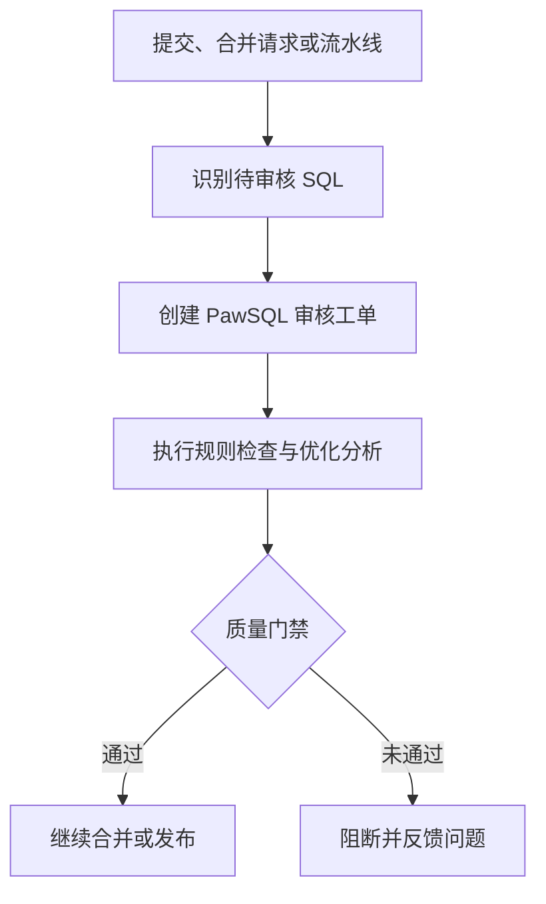

PawSQL 可以在代码提交、合并请求和发布流水线中自动审核 SQL，并根据统一策略返回通过、警告或阻断结果。选择接入方式时，应先区分**预置连接器**与**通用接口集成**。

## 支持矩阵

| 集成类型 | 平台 | 接入方式 | 支持状态 |
| --- | --- | --- | --- |
| 代码仓库 | 腾讯 CODING | PawSQL 预置连接器 | 开箱即用 |
| 代码仓库 | GitHub | PawSQL 预置连接器 | 开箱即用 |
| 代码仓库 | GitLab | PawSQL 预置连接器 | 开箱即用 |
| CI/CD 流水线 | 蓝鲸 | PawSQL 预置连接器 | 开箱即用 |
| 其他代码仓库或流水线 | Jenkins、GitHub Actions、GitLab CI、Azure Pipelines 等 | OpenAPI 或定制开发 | 非预置 |
| 企业研发平台 | 自研 DevOps、审批和发布平台 | OpenAPI、Webhook 或定制开发 | 非预置 |

<Info>
  “非预置”不表示无法接入，而是 PawSQL 未提供该平台的专用连接器。客户需要通过 OpenAPI 或企业集成服务完成流程编排。
</Info>

## 选择接入方式

<CardGroup cols={2}>
  <Card title="代码仓库连接器" href="/user-guide/cicd/repositories" icon="code-branch">
    连接 CODING、GitHub 或 GitLab，在提交和合并请求阶段审核 SQL。
  </Card>
  <Card title="蓝鲸流水线连接器" href="/user-guide/cicd/blueking" icon="diagram-project">
    在蓝鲸流水线中添加 PawSQL 审核和质量门禁步骤。
  </Card>
  <Card title="OpenAPI 流水线集成" href="/user-guide/cicd/openapi-pipeline" icon="code">
    将 PawSQL 接入未提供预置连接器的 CI/CD 平台。
  </Card>
  <Card title="接入未预置的平台" href="/user-guide/cicd/unsupported-platforms" icon="puzzle-piece">
    为 Jenkins、Gitee、CodeArts 与自研平台选择 OpenAPI、Webhook 或集成服务。
  </Card>
</CardGroup>

## 标准工作流

## 开始之前

准备 PawSQL 服务地址、集成账号、目标项目、审核工作空间和审核策略。工作空间必须与 SQL 实际使用的数据库类型和版本一致；需要结构上下文时，还应导入 DDL 或配置数据库连接。

<Warning>
  自动审核不会执行 SQL，也不替代业务验证、数据库权限、变更审批、备份和回退机制。生产仓库启用前，应使用脱敏 SQL 和非生产环境完成验收。
</Warning>

## 下一步

先阅读[集成流程与核心概念](/user-guide/cicd/concepts)和[接入前准备与安全要求](/user-guide/cicd/prerequisites)，再选择对应连接器。
