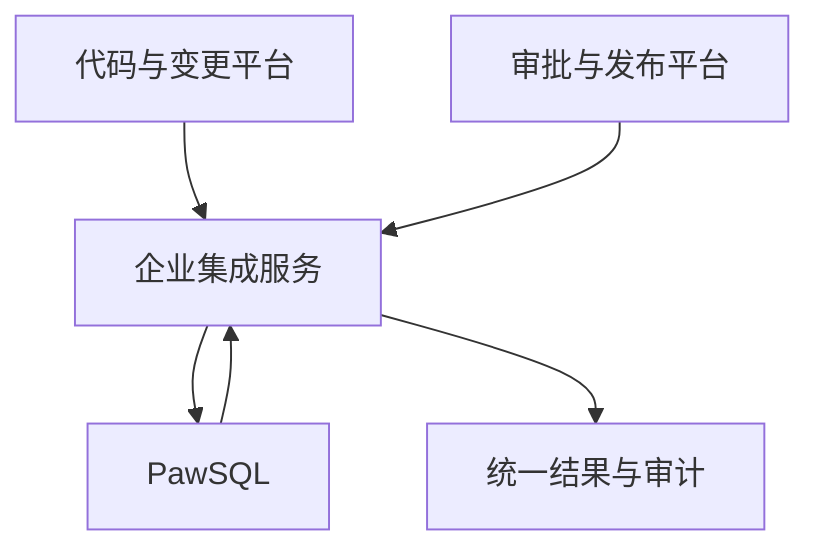

PawSQL 未为 Jenkins、GitHub Actions、GitLab CI、Azure Pipelines、Gitee、Bitbucket、CodeArts 等平台提供预置连接器。只要平台能够检出代码、保护密钥、执行 HTTP 请求并设置运行状态，就可以通过 PawSQL OpenAPI 或企业适配器实现 SQL 审核。企业自研的研发门户、审批与发布平台同样可以通过集成服务接入。

## 常见平台示例

- Jenkins、GitHub Actions、GitLab CI 和 Azure Pipelines；
- Gitee 和 Gitee Go；
- 华为云 CodeArts；
- Bitbucket Pipelines；
- TeamCity 或 Bamboo；
- Tekton 或 Argo Workflows；
- 企业内部通用流水线引擎。

<Info>
  上述平台仅表示可实施通用集成，不属于 PawSQL 预置连接器支持清单。
</Info>

## 平台能力检查

| 能力 | 最低要求 |
| --- | --- |
| 代码访问 | 获取当前提交、比较基线和变更文件 |
| Secret 管理 | 安全保存并掩码 PawSQL 凭据 |
| HTTP 调用 | 发送认证请求并解析 JSON 响应 |
| 工单控制 | 支持轮询、超时和退出码 |
| 结果展示 | 输出摘要、归档报告或设置提交状态 |

## 接入路径选择

| 场景 | 接入方式 | 说明 |
| --- | --- | --- |
| 流水线主动调用 | [OpenAPI 流水线集成](/user-guide/cicd/openapi-pipeline) | 流水线负责提交、轮询与门禁 |
| 事件驱动的代码仓库 | [Webhook 集成](/user-guide/cicd/webhook) | 平台通过事件通知 PawSQL |
| 企业自研平台（门户/审批/发布） | 企业集成服务（见下节） | 由集成服务统一封装与审计 |

## 企业自研平台（集成服务）

企业自研平台通常需要统一管理多个代码仓库、数据库环境和审批流程。建议由集成服务封装 PawSQL OpenAPI，而不是让每个业务系统直接保存 PawSQL 凭据和实现门禁逻辑。

### 推荐架构

### 集成服务职责

- 验证调用方身份和权限；
- 映射组织、应用、仓库、环境、工作空间和策略；
- 提取、分段和提交 SQL；
- 管理异步状态、超时和重试；
- 将结果转换为企业平台的统一风险模型；
- 回传审批结论和报告链接；
- 保存端到端关联标识和审计记录。

### 建议的映射关系

| 企业对象 | PawSQL 对象 |
| --- | --- |
| 租户或部门 | 组织或项目边界 |
| 应用系统 | 项目、标签或集成配置 |
| 数据库环境 | 工作空间 |
| 变更类型 | 审核策略 |
| 发布单或工单 | 外部运行标识 |
| 风险等级 | 问题严重级别与门禁结论 |

### 可靠性设计

- 使用稳定的外部请求 ID 实现幂等；
- 将工单创建和状态查询设计为异步流程；
- 对临时网络错误采用有限重试和退避；
- 对 SQL 违规、认证失败等确定性错误不自动重试；
- 保存 PawSQL 工单 ID，便于恢复中断的状态查询；
- 为 API 版本升级建立兼容性测试；
- 对大脚本设置拆分、大小和总处理时间限制。

### 安全边界

集成服务不应使用数据库高权限账号执行 SQL。PawSQL 审核所需的 SQL、DDL 和元数据应按照企业数据分类进行传输、脱敏和留存。

<Warning>
  如果自研平台允许自动执行审核后的 SQL，应将「审核」和「执行」设计成两个独立权限域，并保留人工审批、备份和回退控制。
</Warning>

## 何时拆分专用文档

只有当平台拥有稳定的专用连接器、独特配置界面或持续维护的模板时，才建议拆分独立页面。否则应在本页维护通用模式和经过验证的示例，避免产生大量内容重复的薄文档。
