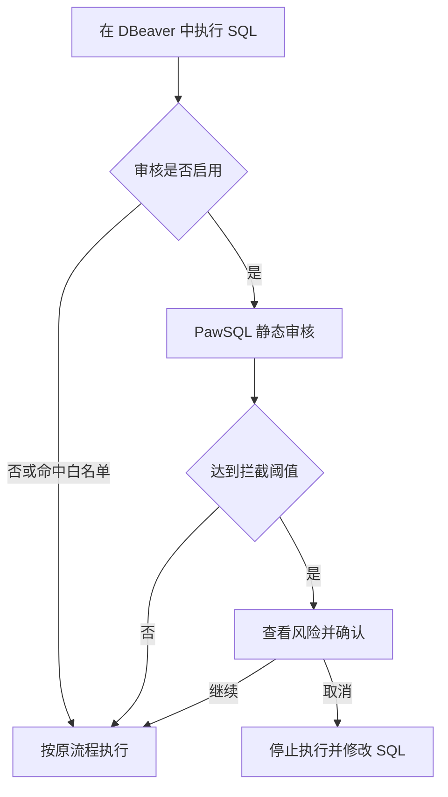

PawSQL Client for DBeaver 在 SQL 编辑器的执行链路中增加审核步骤。SQL 提交给数据库之前，插件先调用 PawSQL 进行静态规则分析，再根据审核模式和风险阈值决定直接继续、提示确认或取消执行。

## 适用场景

- 防止缺少必要条件的 `UPDATE` 或 `DELETE` 直接执行；
- 在执行 DDL 前提示潜在的数据和可用性风险；
- 发现全表扫描、缺少有效索引或不合理连接；
- 在生产数据源上建立统一的执行前检查；
- 为新成员提供即时 SQL 规范反馈。

## 安装前准备

- 已安装兼容版本的 DBeaver；
- 已取得 PawSQL 官方发布的 DBeaver 插件包或安装地址；
- 可以访问 PawSQL Cloud 或 PawSQL Server；
- 已获得目标项目、工作空间和审核策略的使用权限；
- 已了解 DBeaver 中哪些数据源属于开发、测试或生产环境。

## 安装插件

通过软件仓库安装 PawSQL for DBeaver，步骤详见[安装 IDE 插件](/user-guide/installation/ide-plugins)。安装完成后，在 **偏好设置** 中确认可以看到 **PawSQL Client** 配置项。

<Note>
具体安装入口和兼容版本可能随 DBeaver 与插件版本变化，应以对应插件包内的安装说明为准。
</Note>

## 连接 PawSQL

在 **偏好设置 > PawSQL Client** 中配置当前部署要求的服务地址和认证信息，然后选择或确认审核使用的项目、工作空间及策略。首次配置建议使用一条只读 SQL 验证连接，不要直接在生产库测试拦截流程。

<Frame caption="偏好设置中的 PawSQL Client 配置">
  
</Frame>

## 配置执行审核模式

| 模式 | 行为 | 推荐用途 |
| --- | --- | --- |
| 关闭 | 不调用执行前审核，保留 DBeaver 原有执行流程 | 临时停用或明确不需要审核的环境 |
| 提醒 | 执行前询问是否送审、直接执行或取消 | 个人开发和逐步推广 |
| 强制 | 自动送审；达到阈值时要求确认后才能继续 | 生产环境、团队规范和新人防错 |

建议先在测试数据源使用“提醒”模式验证规则和延迟，再逐步对关键数据源启用“强制”模式。

## 设置风险阈值

审核结果使用以下严重级别：

| 级别 | 典型含义 | 示例 |
| --- | --- | --- |
| Critical | 可能造成严重数据或运行风险 | 危险 DDL、关键表缺少必要保护条件 |
| Warning | 通常需要在执行前评估 | 过滤条件无法有效使用索引 |
| Info | 规范或改进提示 | `SELECT *`、缺少结果集限制 |

阈值决定哪些级别需要拦截确认。例如阈值为 **Warning** 时，`Critical` 和 `Warning` 需要确认，`Info` 可以直接通过。

<Warning>
调整阈值后，应先使用代表性 SQL 验证实际覆盖范围。不要仅根据“高”“低”字样推断严格程度；以配置页面展示的被拦截级别为准。
</Warning>

## 配置数据源白名单

白名单适用于无需执行前审核的数据源，例如隔离的本地开发库。命中白名单后，SQL 可在各审核模式下直接进入原执行流程。

添加白名单前确认：

- 数据源名称和连接信息可以唯一识别目标环境；
- 不使用过于宽泛的名称或匹配条件；
- 生产和预生产数据源不因复制配置而意外进入白名单；
- 白名单有明确维护人，并定期复查。

## 执行和处理审核结果

<Steps>
  <Step title="执行 SQL">
    在 DBeaver SQL 编辑器中发起正常执行操作。
  </Step>
  <Step title="等待静态审核">
    插件提交 SQL 和所需上下文；执行前审核不会实际运行 SQL 或创建推荐索引。
  </Step>
  <Step title="阅读风险详情">
    查看最高风险级别、触发规则、对应 SQL 片段，以及可用的索引或重写建议。
  </Step>
  <Step title="作出执行决定">
    修改 SQL 后重新审核，取消本次执行，或在确认风险可接受后继续。
  </Step>
</Steps>

<Frame caption="执行前审核的风险提示">
 
</Frame>

点击继续执行只表示操作者接受本次提示，不代表 SQL 已完成正式审批。关键环境仍应遵循组织的发布和授权流程。

## 预期结果

启用审核后，插件返回带严重级别的规则问题；当达到配置的阈值时，弹出风险提示，供你修改 SQL、取消或继续执行。

## 验证

在非生产数据源上执行一条只读 SQL，确认预期问题或风险提示出现、且高风险 SQL 按配置的阈值被拦截，即可验证集成正常。

## 静态审核与深度优化

| 能力 | 执行前审核 | 一键优化 |
| --- | --- | --- |
| 目标 | 快速识别执行风险 | 形成可验证的优化方案 |
| 是否实际执行 SQL | 否 | 取决于验证配置 |
| 是否创建 What-If 索引 | 否 | 可能，取决于配置和数据库能力 |
| 输出 | 规则问题和风险级别 | 审核、重写、索引及性能证据 |

执行前审核强调低延迟和无副作用。需要比较执行计划、评估索引收益或实际耗时时，再使用完整优化流程。

## 常见问题

| 现象 | 优先检查 |
| --- | --- |
| 偏好设置中没有 PawSQL Client | 插件安装状态、兼容版本和是否完成重启 |
| 每次执行都未触发审核 | 审核模式、数据源白名单和插件状态 |
| 本应拦截的 SQL 直接通过 | 风险阈值、审核策略、数据库上下文和规则状态 |
| 审核请求失败 | PawSQL 地址、网络、TLS、认证和服务状态 |
| 表或索引识别不正确 | 工作空间、Schema 和元数据更新时间 |
| 审核延迟影响操作 | 网络延迟、服务负载、输入大小和脚本拆分方式 |

## 上线建议

1. 在开发或测试数据源验证连接和规则结果。
2. 使用“提醒”模式收集代表性 SQL 和误报反馈。
3. 调整审核策略、阈值和白名单。
4. 对关键数据源启用“强制”模式。
5. 明确绕过、故障降级和审计记录要求。
6. 定期复查白名单和高风险 SQL 的处理情况。

## 相关文档

<CardGroup cols={2}>
  <Card title="SQL 审核" href="/user-guide/sql-audit" />
  <Card title="选择审核策略" href="/user-guide/sql-audit/select-audit-policy" />
  <Card title="查看审核结果" href="/user-guide/sql-audit/read-audit-results" />
  <Card title="高风险 SQL 管控" href="/user-guide/sql-audit/high-risk-sql-control" />
</CardGroup>
