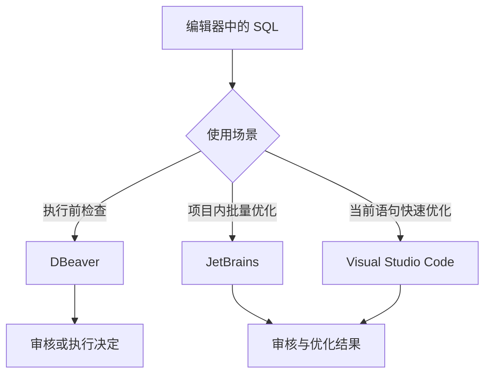

PawSQL Client 将 SQL 审核和性能优化能力嵌入常用开发工具。开发人员可以在不切换工作环境的情况下审核待执行 SQL，或获取查询重写、索引推荐和性能验证结果。

## 支持的集成方式

| 集成方式 | 适用工具 | 主要工作流 |
| --- | --- | --- |
| PawSQL Client for DBeaver | DBeaver | SQL 执行前审核与高风险确认 |
| PawSQL Client for JetBrains | IntelliJ IDEA、DataGrip、PyCharm、GoLand、WebStorm、PhpStorm、DataSpell、Android Studio 等 | 优化选中的 SQL、SQL 文件或目录 |
| PawSQL Client for VS Code | Visual Studio Code | 在代码或 SQL 文件中快速优化选中的 SQL |
| PawSQL MCP | 支持 MCP 的 AI 编程工具 | 通过自然语言优化 SQL |

<Note>
JetBrains 插件在部分历史文档和界面中称为 **PawSQL Advisor**。本手册统一使用 **PawSQL Client for JetBrains**，涉及旧界面时保留原命令名称。
</Note>

## 选择合适的集成方式

| 目标 | 推荐集成方式 |
| --- | --- |
| 在数据库客户端点击执行前检查 SQL 风险 | DBeaver |
| 在 DataGrip 或 IntelliJ IDEA 中优化单条 SQL | JetBrains |
| 批量分析 SQL 文件、目录或 MyBatis Mapper | JetBrains |
| 在轻量级编辑器或多语言代码仓库中优化 SQL | VS Code |
| 通过 AI 编程工具调用 PawSQL | 使用 [PawSQL MCP](/user-guide/dev-tools/mcp) |

## 工作方式

## 集成方式如何连接 PawSQL

这些集成方式都需要访问 PawSQL Cloud 或 PawSQL Server，并在授权范围内使用项目和工作空间。服务地址、认证方式、安装入口和操作命令由各平台文档分别说明。

开始前应准备 PawSQL 服务地址、有效账号以及与目标数据库匹配的工作空间。有关认证和数据库上下文的通用概念，请参阅[登录与身份认证](/user-guide/installation/authentication)和[工作空间与数据库上下文](/user-guide/workspaces)。

## 本分组包含

<CardGroup cols={2}>
  <Card title="DBeaver 插件" href="/user-guide/dev-tools/dbeaver" icon="database">
    配置 SQL 执行前审核、风险阈值和数据源白名单。
  </Card>
  <Card title="JetBrains 插件" href="/user-guide/dev-tools/jetbrains" icon="code">
    优化选中的 SQL、SQL 文件、目录或 MyBatis Mapper。
  </Card>
  <Card title="Visual Studio Code 插件" href="/user-guide/dev-tools/vscode" icon="code">
    在代码或 SQL 文件中快速优化当前语句。
  </Card>
  <Card title="PawSQL MCP" href="/user-guide/dev-tools/mcp" icon="bot">
    在支持 MCP 的 AI 编程工具中通过自然语言优化 SQL。
  </Card>
</CardGroup>

## 通用安全边界

- 使用可信来源的插件包，并核对发布者与版本；
- 凭据应保存在客户端安全存储中，不应进入 Git 仓库；
- 工作空间应与 SQL 的目标数据库和环境一致；
- DBeaver 白名单只应用于明确允许绕过审核的数据源；
- 推荐 SQL 和索引 DDL 必须经过语义、性能和发布验证；
- 在生产数据库启用实际执行或 What-If 验证前评估资源和锁影响。

<Warning>
安装插件不会替代组织的数据库权限、变更审批、备份和回退机制。插件结果应作为开发与发布流程中的技术证据使用。
</Warning>

## 下一步

先安装插件（见[安装 IDE 插件](/user-guide/installation/ide-plugins)），再选择与当前工具匹配的平台页面完成配置。首次使用时，建议提交一条已脱敏、只读且结果可预期的 SQL，确认服务、权限和工作空间配置正确。
