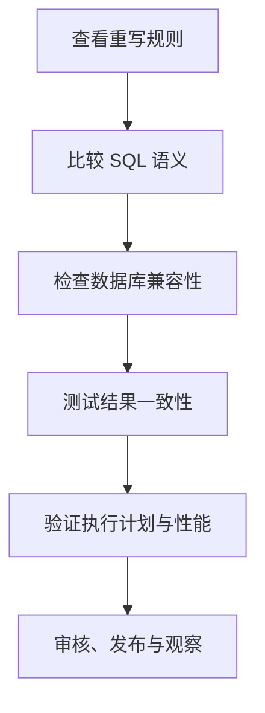

PawSQL 可以根据优化规则生成重写 SQL。应用重写结果前，必须确认业务语义、数据库兼容性和性能收益，不能只比较 SQL 长度或预估代价。

## 应用流程

## 1. 阅读重写说明

先确认：

- 触发了哪项优化规则；
- 原始 SQL 的哪一部分发生变化；
- 重写依赖哪些条件、约束或数据库特性；
- 是否存在不适用情况；
- PawSQL 是否提供验证信息。

如果工作空间缺少主键、唯一约束或数据类型等信息，应先补充数据库上下文，再评估依赖这些信息的重写。

## 2. 检查语义

| 检查项 | 需要确认的内容 |
| --- | --- |
| 返回列 | 列数量、顺序、别名和数据类型一致 |
| 行集合 | 重复行、去重和行数语义一致 |
| `NULL` | 三值逻辑、空值比较和聚合行为一致 |
| 连接 | 内外连接方向、匹配条件和未匹配行处理一致 |
| 过滤 | 条件作用位置和过滤范围一致 |
| 聚合 | 分组键、聚合函数和 HAVING 行为一致 |
| 排序分页 | 顺序稳定性、条数和偏移量一致 |
| 数据修改 | 目标表、影响范围和修改值一致 |

<Warning>
涉及 `NULL`、外连接、重复行、非确定性函数、隐式类型转换和数据修改语句时，应进行更严格的结果一致性验证。
</Warning>

## 3. 检查数据库兼容性

- 重写语法是否被目标数据库版本支持；
- 函数、类型转换和日期时间语义是否一致；
- 标识符引号、大小写和关键字是否正确；
- 分页、锁、Hint 和数据库专有语法是否保留；
- 分布式数据库的分布键和数据移动是否受到影响；
- SQL 所在的 ORM、框架或存储过程是否接受新写法。

工作空间版本必须与实际运行环境一致。不要只在另一种数据库或更高版本中验证语法。

## 4. 验证结果一致性

建议至少覆盖：

- 空结果；
- 单行和多行结果；
- 含 `NULL` 的数据；
- 重复值；
- 边界日期和数值；
- 常见参数与高选择率、低选择率参数；
- 业务已知的特殊案例。

对于查询 SQL，可比较行数、关键列、集合差异或校验值。对于 DML，应在隔离环境中比较影响行数和最终数据状态。

## 5. 验证性能

性能验证应使用相同环境、数据、参数和会话条件。比较：

- 执行计划及关键算子；
- 预估代价和预估行数；
- 实际耗时和资源消耗；
- 扫描行数、排序或临时数据量；
- 分布式环境中的数据移动；
- 多次执行后的稳定性。

一次执行更快不一定代表稳定收益。应考虑缓存预热、并发和参数差异。

## 6. 应用到代码

<Steps>
  <Step title="复制重写 SQL">
    使用产品提供的复制功能，并检查语句是否完整。
  </Step>
  <Step title="适配应用参数">
    恢复 ORM、模板或预编译语句需要的参数形式，不改变参数类型和绑定顺序。
  </Step>
  <Step title="提交代码评审">
    在变更说明中附上原始 SQL、重写规则、验证结果和回退方案。
  </Step>
  <Step title="完成测试和发布">
    执行功能、回归与性能测试，再按组织流程发布。
  </Step>
  <Step title="上线后观察">
    检查耗时、错误、资源和执行计划是否符合预期。
  </Step>
</Steps>

## 不应直接采用的情况

- SQL 或对象未完整解析；
- 工作空间与目标数据库不一致；
- 无法解释重写规则或适用条件；
- 结果一致性测试失败；
- 仅有预估收益，没有满足要求的验证；
- 性能提升依赖特殊参数且可能造成其他参数回退；
- 应用框架不支持重写后的语法或参数方式。

## 记录建议

保留原始 SQL、重写 SQL、PawSQL 任务编号、数据库版本、工作空间、测试数据范围、参数、计划对比、性能结果、评审人和回退方式。

## 下一步

<CardGroup cols={2}>
  <Card title="验证优化效果" href="/user-guide/optimization/verify-result" />
  <Card title="查看与对比执行计划" href="/user-guide/optimization/compare-plans" />
  <Card title="优化算法" href="/reference/optimizer-rules/index" />
  <Card title="优化历史与结果导出" href="/user-guide/optimization/history-export" />
</CardGroup>
