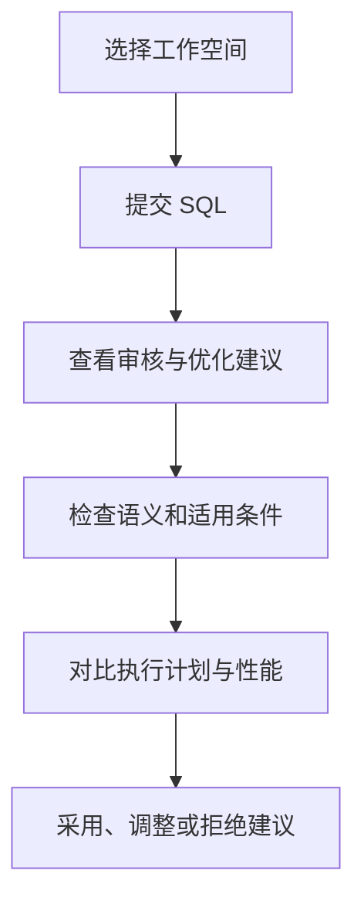

PawSQL 将 SQL 解析、规范检查、自动重写、索引推荐、执行计划分析和性能验证组织为一条可追溯的优化流程。你可以从 Web 控制台、IDE 插件、PawSQL MCP 或 API 发起优化任务。

## 优化工作流

<Steps>
  <Step title="准备 SQL 和数据库上下文">
    确认目标数据库类型、版本和 Schema。工作空间中的表、索引、约束和统计信息越完整，分析结果越贴近真实环境。
  </Step>
  <Step title="提交 SQL">
    输入完整 SQL，并按需提供参数、默认 Schema 和任务说明。
  </Step>
  <Step title="阅读建议">
    检查规范问题、SQL 重写、索引推荐以及执行计划分析，不以建议数量判断优化价值。
  </Step>
  <Step title="验证正确性和收益">
    确认重写前后语义一致，并通过执行计划、预估代价或隔离环境实测评估收益。
  </Step>
  <Step title="记录处理结论">
    将建议标记为采用、调整、拒绝或待验证，并保留原因和验证证据。
  </Step>
</Steps>

## 本分组包含

<CardGroup cols={2}>
  <Card title="提交并优化一条 SQL" href="/user-guide/optimization/submit-sql" />
  <Card title="查看优化建议" href="/user-guide/optimization/review-suggestions" />
  <Card title="应用 SQL 重写结果" href="/user-guide/optimization/apply-rewrite" />
  <Card title="应用索引推荐" href="/user-guide/optimization/apply-index" />
  <Card title="验证优化效果" href="/user-guide/optimization/verify-result" />
  <Card title="查看与对比执行计划" href="/user-guide/optimization/compare-plans" />
  <Card title="优化历史与结果导出" href="/user-guide/optimization/history-export" />
</CardGroup>

## 选择使用入口

| 入口 | 适用场景 | 特点 |
| --- | --- | --- |
| Web 控制台 | 临时分析、复杂 SQL、完整结果查看 | 功能完整，适合对比和导出 |
| IDE 插件 | 编码阶段即时优化 | 无需离开开发环境 |
| PawSQL MCP | AI 编程助手工作流 | 可在当前开发上下文中调用工具 |
| API | 平台集成、批量调用和自动化 | 适合可重复、可编排流程 |

## 如何判断建议是否可采用

| 判断维度 | 需要回答的问题 |
| --- | --- |
| 语义正确性 | 重写后是否返回相同结果并保持相同业务含义？ |
| 数据库兼容性 | 目标数据库类型和版本是否支持该语法或索引？ |
| 性能收益 | 执行计划、预估代价或实测指标是否改善？ |
| 变更成本 | 是否增加写入、存储、锁和维护成本？ |
| 上线风险 | 是否完成测试、审核、回退和发布准备？ |

<Warning>
重写 SQL 和索引定义不能因为由工具生成就直接用于生产。任何变更都应经过语义检查、测试验证和组织规定的发布流程。
</Warning>

## 开始前检查

- 已选择正确的工作空间；
- 数据库类型和版本与目标环境一致；
- SQL 引用对象已经导入或同步；
- 参数占位符和默认 Schema 清晰；
- SQL 已脱敏；
- 已准备可用于验证的开发或测试环境。

## 延伸阅读

- 配置上下文：[工作空间与数据库上下文](/user-guide/workspaces)
- 了解能力：[自动 SQL 重写](/features/automatic-sql-rewrite)、[索引推荐](/features/index-recommendation)
- 查询算法：[优化算法](/reference/optimizer-rules/index)
