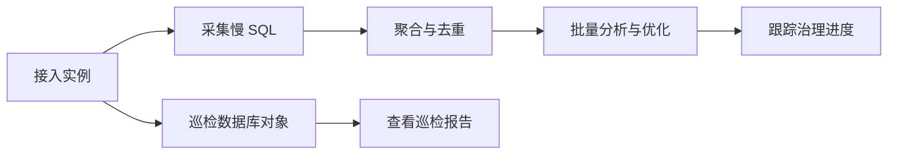

性能巡检平台（PawSQL Performance Patroller）对已接入的数据库实例持续采集慢查询、巡检数据库对象，把分散的性能问题收敛为可量化、可跟踪、可批量优化的治理任务。它独立于优化平台的单条 SQL 优化流程，面向的是"一个实例上成百上千条慢 SQL 与对象缺陷"的持续治理场景。

<Frame caption="性能巡检平台概览：实例指标、近七天慢 SQL 与数据库巡检 Top 5">
  
</Frame>

## 治理工作流

按以下顺序推进（前四步是接入与数据准备，后三步是治理动作）：

<Steps>
  <Step title="接入数据库实例">
    添加实例，填写连接信息并完成慢查询与巡检配置。
  </Step>
  <Step title="采集慢 SQL">
    从数据库慢查询日志采集慢 SQL，可手动触发或按计划定时采集。
  </Step>
  <Step title="创建性能巡检任务">
    为实例配置巡检模板，手动或定时巡检数据库对象。
  </Step>
  <Step title="SQL 聚合与去重">
    对采集结果按 SQL 结构聚合去重，过滤出业务 SQL，形成治理清单。
  </Step>
  <Step title="批量分析与优化">
    对选中的慢 SQL 批量发起优化或 AI 优化，生成重写与索引建议。
  </Step>
  <Step title="查看巡检报告">
    从数据库对象维度查看巡检发现的风险分布与 Top 问题。
  </Step>
  <Step title="跟踪治理进度">
    通过优化状态、处置阶段和性能提升跟踪每条 SQL 的治理进展。
  </Step>
</Steps>

## 核心对象

| 对象 | 作用 |
| --- | --- |
| 实例 | 已接入的目标数据库，保存连接信息、慢查询阈值与巡检模板配置 |
| 慢查询 | 从慢查询日志采集并聚合后的 SQL，带耗时、执行次数与治理状态 |
| 巡检模板 | 定义巡检时启用的审核规则与风险级别 |
| 数据库对象 | 实例中的表，带列数、行数、索引数与巡查异常数 |
| 巡检报告 | 汇总数据库对象数、风险级别分布与 Top 规则、Top 对象 |

## 本分组包含

### 接入与采集

<CardGroup cols={2}>
  <Card title="接入数据库实例" href="/user-guide/performance/connect-instance" />
  <Card title="采集慢 SQL" href="/user-guide/performance/collect-slow-sql" />
  <Card title="创建性能巡检任务" href="/user-guide/performance/patrol-task" />
</CardGroup>

### 分析与治理

<CardGroup cols={2}>
  <Card title="SQL 聚合与去重" href="/user-guide/performance/aggregate-dedup" />
  <Card title="批量分析与优化" href="/user-guide/performance/batch-optimize" />
  <Card title="查看巡检报告" href="/user-guide/performance/reports" />
  <Card title="跟踪治理进度" href="/user-guide/performance/track-progress" />
</CardGroup>

## 按角色开始

| 角色 | 推荐页面 | 主要职责 |
| --- | --- | --- |
| DBA | 实例接入、巡检报告 | 维护实例连接与巡检模板，判断结构风险 |
| 性能优化工程师 | 慢查询、批量优化 | 分析慢 SQL、发起批量优化并跟踪提升 |
| 开发人员 | 慢查询、治理进度 | 处理归属本团队的慢 SQL 与对象缺陷 |
| 项目管理员 | 实例概览、配置 | 维护实例清单、采集/巡检计划与团队分工 |

## 开始前检查

- 目标数据库可被 PawSQL 服务端网络访问（连接校验在服务端执行）；
- 已获取数据库主机、端口、账号、密码与目标库名；
- 采集慢查询前已确认数据库慢查询日志已开启且可读；
- 巡检模板与目标数据库类型匹配；
- 当前用户具备添加实例与查看巡检数据的权限。

<Warning>
巡检与优化建议用于辅助分析，不替代业务评审、测试验证、备份、审批与发布控制。
</Warning>

## 延伸阅读

- 优化平台单条 SQL 优化流程：[性能优化工作流](/user-guide/optimization/)
- 审核规则定义：[审核规范](/reference/audit-rules/)
- 数据库上下文：[工作空间与上下文](/user-guide/workspaces/)
