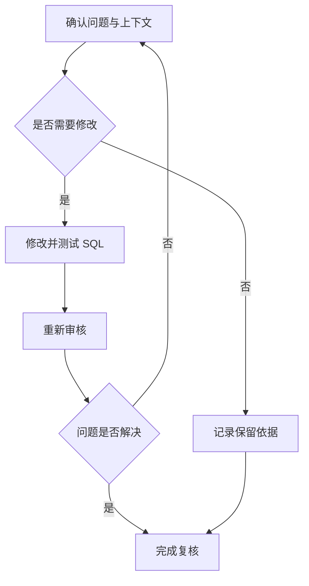

处理审核问题的目标不仅是减少告警数量，还要确认风险得到消除、业务语义保持一致，并留下可复核的处理记录。

## 目标

对 SQL 审核问题进行确认、修改、复核和例外记录，形成可追踪的闭环。

## 准备工作

有一张包含待处理问题的审核工单，并具备修改 SQL 和重新审核的权限。

## 处理流程

## 逐项处理

<Steps>
  <Step title="确认触发原因">
    阅读规则说明、SQL 位置和相关对象，检查数据库版本及工作空间是否正确。
  </Step>
  <Step title="评估业务影响">
    确认问题是否影响正确性、性能、安全、可维护性或发布流程。
  </Step>
  <Step title="选择处理方式">
    修改 SQL、补充上下文、调整不适用的工单配置，或按流程申请保留。
  </Step>
  <Step title="验证修改">
    执行语义校验、测试和必要的性能验证，确保结果集及数据变更符合预期。
  </Step>
  <Step title="重新审核">
    使用相同或明确升级后的策略和工作空间再次审核，比较问题变化。
  </Step>
  <Step title="记录结论">
    保存修改内容、验证证据、剩余风险、处理人和关联单据。
  </Step>
</Steps>

## 常见处理方式

| 情况 | 建议处理 |
| --- | --- |
| SQL 确实违反规则 | 根据建议修改，并进行测试和复核 |
| 元数据缺失导致误判 | 更新工作空间后重新审核 |
| 数据库版本配置错误 | 修正版本后重新创建或执行审核 |
| 规则不适用于当前场景 | 记录业务依据，按例外流程处理 |
| 同类问题大量重复 | 先定位共同原因，再批量修复并抽样验证 |
| 建议可能改变语义 | 不直接采用，先由开发人员和 DBA 评估 |

## 修改后的验证

至少确认：

- SQL 可以被目标数据库正确解析；
- 查询结果或数据变更语义未改变；
- 事务、锁和并发行为符合预期；
- 索引或重写建议在代表性数据上有效；
- 原问题不再触发，且没有新增高风险问题；
- 测试、审批和回退要求已经满足。

<Warning>
自动生成或推荐的 SQL 不应未经验证直接用于生产。涉及 DDL、大范围 DML、锁行为或数据修复时，必须遵守组织的变更流程。
</Warning>

## 保留问题和例外

确需保留某个问题时，进入[人工复核与审批](/user-guide/sql-audit/manual-review-and-approval)的例外流程：记录业务依据、影响范围和补偿控制，并把例外限定在最小范围。不要通过降低全局规则级别来处理单个例外。

## 批量治理建议

- 按高风险、核心系统和高频 SQL 排序；
- 按规则聚类，识别可以统一修复的模式；
- 小批量修改并进行回归验证；
- 对比修复前后的问题分布和性能数据；
- 将成熟做法沉淀到开发规范和审核策略。

## 预期结果

修复并重新审核后，已解决的问题不再触发、无新增高风险问题，处理结果和证据被记录。

## 下一步

高风险问题参阅[高风险 SQL 管控](/user-guide/sql-audit/high-risk-sql-control)；需要人工结论时，进入[人工复核与审批](/user-guide/sql-audit/manual-review-and-approval)。
