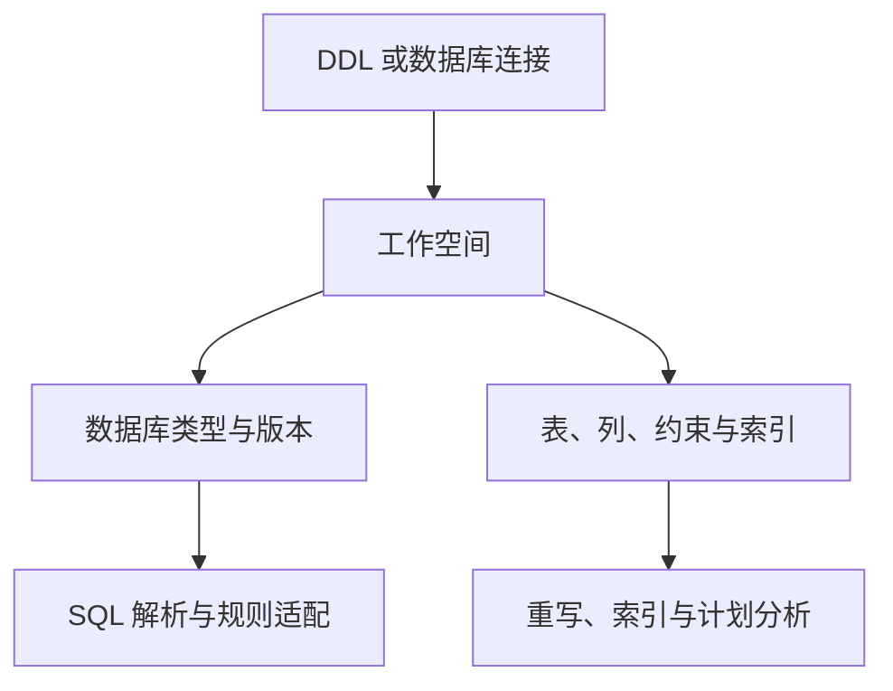

工作空间是 PawSQL 组织 SQL 分析上下文的基本单位。它记录目标数据库类型、版本、Schema 以及可用的表、列、约束和索引等元数据，供 SQL 审核、自动重写、索引推荐、执行计划分析和性能验证使用。

<Note>
工作空间不是业务数据库，也不会因为被创建而修改目标数据库。它保存的是 PawSQL 分析 SQL 时需要使用的上下文。
</Note>

## 工作空间如何参与 SQL 分析



同一条 SQL 在不同数据库类型、版本、Schema 或索引条件下，可能得到不同的解析和优化结果。因此，提交任务前应先确认所选工作空间与 SQL 的真实运行环境一致。

## 两种创建方式

| 对比项 | 通过 DDL 创建 | 通过数据库连接创建 |
| --- | --- | --- |
| 是否连接数据库 | 不需要 | 需要 |
| 元数据来源 | 用户提供的 DDL | 目标数据库 |
| 表、列和约束 | 取决于 DDL 完整度 | 按账户权限读取 |
| 索引信息 | 需要包含在 DDL 中 | 可从数据库获取 |
| 元数据更新 | 重新导入或编辑 DDL | 重新同步数据库 |
| 执行计划与在线验证 | 通常不可用 | 取决于数据库及账户权限 |
| 适用场景 | 无法直连、快速验证、数据隔离 | 持续治理、精确分析、生产巡检 |

按场景选择：

| 场景 | 推荐方式 |
| --- | --- |
| 临时分析一条 SQL | DDL |
| 数据库位于隔离网络 | DDL |
| 企业禁止第三方保存数据库凭据 | DDL |
| 数据库尚未部署，但已有设计阶段 DDL | DDL |
| 需要为示例、培训或测试建立独立上下文 | DDL |
| 团队长期使用同一数据库 | 数据库连接 |
| 需要同步新增表和索引 | 数据库连接 |
| 需要执行计划或在线性能验证 | 数据库连接，且账户具备必要权限 |

如果只是快速分析一条 SQL，可以先通过 DDL 创建工作空间；如果需要长期审核、批量治理或性能验证，优先考虑数据库连接方式。具体步骤见[通过 DDL 创建](/user-guide/workspaces/create-from-ddl)和[通过数据库连接创建](/user-guide/workspaces/create-from-database)。

## 基本信息建议

工作空间名称应让用户能够快速识别业务系统、数据库类型和环境，例如：

```text
订单系统-MySQL-测试
客户中心-Oracle-生产
数据仓库-Hive-开发
```

不要只使用“测试”“数据库一”等缺少上下文的名称。其他配置建议：

| 配置项 | 建议 |
| --- | --- |
| 名称 | 包含业务、数据库类型和环境 |
| 描述 | 说明用途、数据来源和负责人 |
| 数据库类型 | 与 SQL 的真实运行环境一致 |
| 数据库版本 | 使用真实版本，不默认选择最新版本 |
| 默认 Schema | 选择未限定表名应优先解析的 Schema |
| 元数据范围 | 只导入当前业务和团队需要的对象 |

## 使用原则

- DDL 或数据库元数据发生变化后及时更新工作空间。
- 删除或替换工作空间前确认历史任务和团队成员的依赖。
- 采用优化建议前，仍需在目标环境完成验证。

## 下一步

<CardGroup cols={2}>
  <Card title="通过 DDL 创建" href="/user-guide/workspaces/create-from-ddl" />
  <Card title="通过数据库连接创建" href="/user-guide/workspaces/create-from-database" />
  <Card title="SQL 优化" href="/user-guide/optimization" />
  <Card title="支持的数据库" href="/getting-started/supported-databases" />
</CardGroup>
